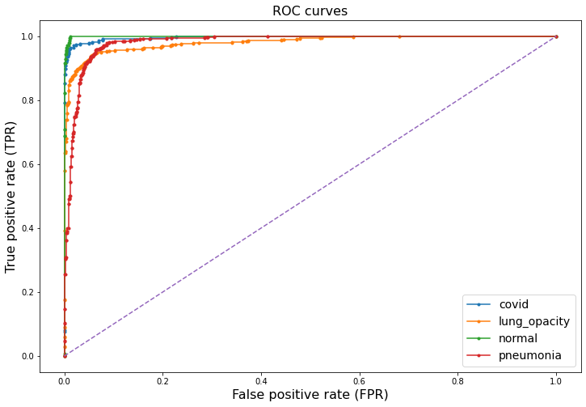

# X-Ray Classification

## Kaggle address

All information available here: https://www.kaggle.com/c/acse4-ml-2020

Use this repository for your submissions. 

## Summary

This project consists on using ResNet Network to classify a set of structured X-rays images of patients to identify whether or not they have pneumonia, COVID-19 or lung opacity. The Neural Network chosen was the RestNet18 as it is one of the preferred for image processing.

## Data Gathering

The dataset was downloaded from [Kaggle](https://www.kaggle.com/c/acse4-ml-2020).

We use 90% of training set be our train data set and 10% be validation set(test set) .

We get unbalanced  data from each category in our original dataset, and we put it randomly into new train set validation set and test set. We use Weighted Random Sampler method to deal with this problem as option.

## Image Preprocessing

Image Rescaling: Since neural networks receive inputs of the same size, all images need to be resized to a fixed size before inputting them to the CNN. The larger the fixed size, the less shrinking required. Less shrinking means less deformation of features and patterns inside the image and therefore higher the chances that the selected algorithm will perform well.

All the images have been rescaled  to [0,1] and could accelerate the model.

Image Crop: All the images are Center Cropped into **224*224**

Data Augmentation: It is well known that the performance of Deep Learning Neural Networks often improves with the amount of data available, therefore increasing the number of data samples could result in a more skillful model. This can be achieved by doing "Data Augmentation", which is a technique to artificially create new training data from existing training data. This is done by applying domain-specific techniques to examples from the training data that create new and different training examples by simply shifting, flipping, rotating, modifying brightness, and zooming the training examples.

For our train subset, the "Data Augmentation" parameters that were used were the following 2:

Random horizontal flip

Normalize

## Model Architecture

We choose to use ResNet as our model, the basic building block of ResNet is: 

  
Instead of hoping each few stacked layers directly fit a desired underlying mapping, we explicitly let these layers fit a residual mapping and it can deal with disappearing gradient and exploding problem.
There is so many parameters but the 20,000 dataset is not enough. It may cause overfitting if we just do data augmentation and add weight decay without using the pretrained model.

For CNN, the first few layers are to extract features and then sampling to expand the sensing area. The achieved features in first few layers are abstract and not directly related to a specific classification task. Also, Use pretrained model could converge faster and achieve higher accuracy. So, we think use pretrained model for medical is safe.

Here is the architecture of Resnet-18. Resnet-34 and ResNet-50 has similar architecture with it.

### Optimizers and Loss

<b>SGD Optimizer with momentum:</b> In most case we chose SGD optimizer with momentum. SGD may prone to saddle point or local minimum but add momentum could overcome this weakness. So it is easy to modify parameters to make it converges well. 

<b>Adam Optimizer:</b> In a few cases we have tried Adam optimizer. It is one of the most popular optimizers. We found it could converges faster than SGD but it is harder to modify the parameters to make it converge. Also in some case the Adam optimizer could not converge so we still chose SGD in our final model.

<b>Cross Entropy:</b> We did not make change of loss function and always use cross entropy as our loss function during the test.

### wandb.ai visualization
#### Random Pick 

#### Grid Search

### Final Model

We have tested over 20 different combinations of hyperparameters, from Resnet-18 to Resnet-34, ResNet-50 to get a higher accuracy and avoid overfitting. You can see some of our test results performs well in `ModelLibrary.ipynb` in `supplementary_files` folder.

One of the most important factors limiting our training is the GPU memory. When we use ResNet-34, we need to compromise on the batch size. We have to cut the pictures into smaller size, sacrifice the edge information of the picture. Even we need to choose smaller batch size when using ResNet-50. This may cause the performance even worse than ResNet-18. In the model parameters selection section, the group used gird search methods to select the most suitable parameters to train the model. The hyperparameters we choose to adjust are epoch, learning rate, momentum, batch-size and the optimizer.

We finally choose the following values of parameters in ResNet-18.

## Models Performance Visualization

###### Test accuracy: 

{0: 0.9841662543295399, 1: 0.9510143493320139, 2: 0.9935675408213755, 3: 0.9445818901533894}

###### False positive/type 1 error/false alarm rate:

 {0: 0.006547619047619024, 1: 0.027368421052631597, 2: 0.004255319148936176, 3: 0.06493506493506496}

###### The patient be diagnosed as normal people rate:

{0: 0.03812316715542522 1: 0.09212730318257957 2: 0.013986013986013986 }

###### False negative/miss/type 2 error rate:

{0: 0.061583577712609916, 1: 0.10067114093959728, 2: 0.03546099290780147, 3: 0.044538706256627814}

###### Precision or positive predictive value:

{0: 0.9667673716012085, 1: 0.9321739130434783, 2: 0.9444444444444444, 3: 0.9279093717816684}

#### confusion matrix

#### ROC curves

## Way Forward

## Notebooks Description

**Final_model.ipynb** Main notebook where all the links to the nested file structure, X-ray image visualization and image re-scaling and augmentation was done. Furthermore what is called the Final Model, selected as the one with the best performance is also describe, ran and evaluated here.

**Model_Library.ipynb**: different models are described on this notebook They are all already ran and evaluated through visualization and accuracy calculations.

**Supplementary_files**: files with some method might be useful for the model.

## Pros and Cons for the Project

### Pros

+ The group successfully visualized the X-Ray pictures, added labels to them, and converted them into corresponding data sets.
+ The group successfully preprocessed the training data and test data to make the images meet the training requirements
+ Using wandb.ai platform roughly find the most suitable parameters of the model
+ The group trained two models and achieved the best results on resnet-18
+ The final result was successfully saved in the csv file and achieved good results
+ Successful teamwork Compared with other groups that carried out projects offline in London, our group collaborated remotely and achieved good results

### Cons

+ The figures used in the models are three channels, the group can switch the figures to single-channel images to reduce training time and improve training efficiency.
+ In the training part, the group imports all the training images into the model at one time. This method is not good for the memory management of the GPU when training the model.
+ The group not fully used the GPU source when training the ResNet-18 network, batchsize can be increase.
+ From the final selected training and figure, it seems that the model is not fully trained. The group just find a local minimum. For a more comprehensive training model, the epoch can be increased appropriately to improve the accuracy.
+ Due to time and GPU memory management issues, the group did not run a deeper neural network model (ResNet-101, ResNet-152, InceptionV3, Densenet,...) successfully to train the data.
+ The group chose two optimization methods, SGD and Adam, and optimized the model separately. In the next improvement, the group should try more optimization methods or combine SGD and Adam to improve optimization efficiency.
## Next step improvement

1. Data Preparation
Using single-channel images instead of three-channel images to train the model and reduce the training time.

2. Optimize step

Using  Pytorch- lightning packages  is better for our RAM and GPU space and multi GPU corporation.

3. Speeding step

   3.1 batch-size accumulation (work for not powerful GPU)

   3.2 multi-GPU training

4. Data Augmentation

   Gauss Laplacian Pyramid Algorithm can be used for produce Accurate Super-Resolution images. And help our model to find more features. (from fig1 to fig2)

   
   

5. Training Step
   
   4.1 The group can separate the dataset and import the data into the model in batches.

   4.2 Increase batchsize to improve GPU usage efficiency 

   4.3 Appropriately increase the number of epochs to observe the training images

6. More model
The group can use more models, such as  Inception v3, ResNet-101. etc

7. Algorithm
Model Averaging can be used to Deal with model uncertainty